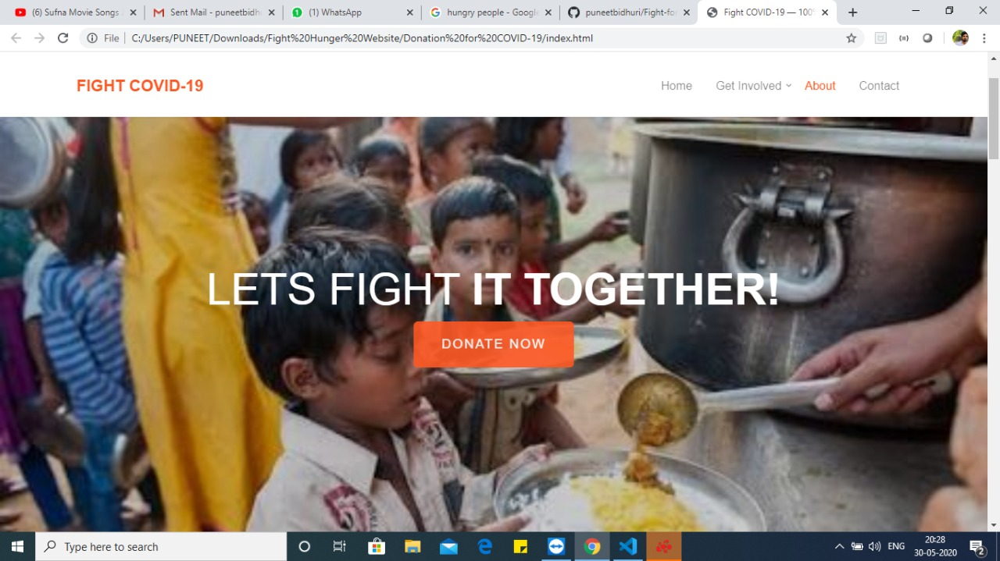
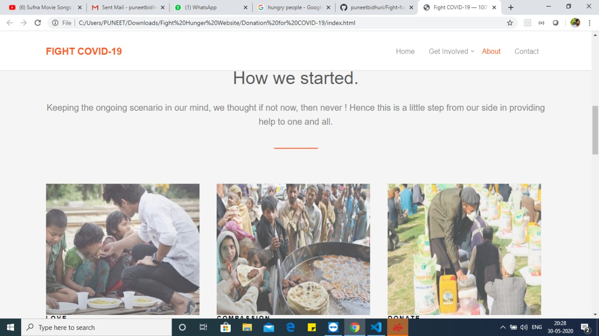
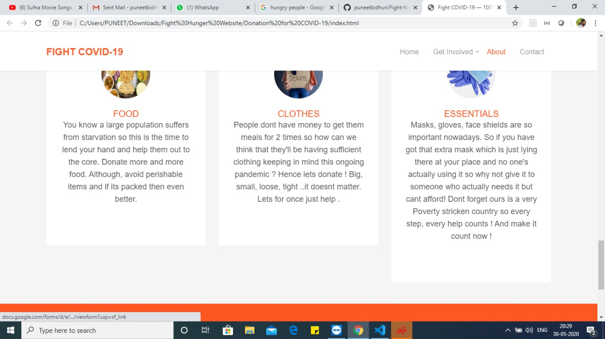
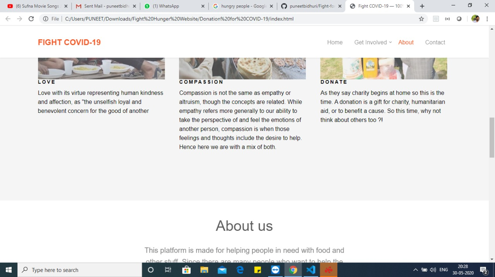
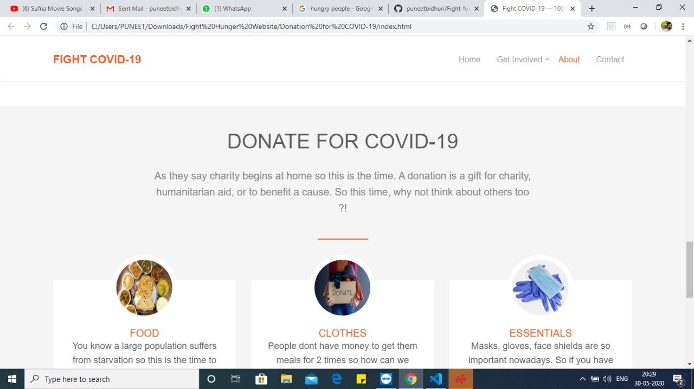
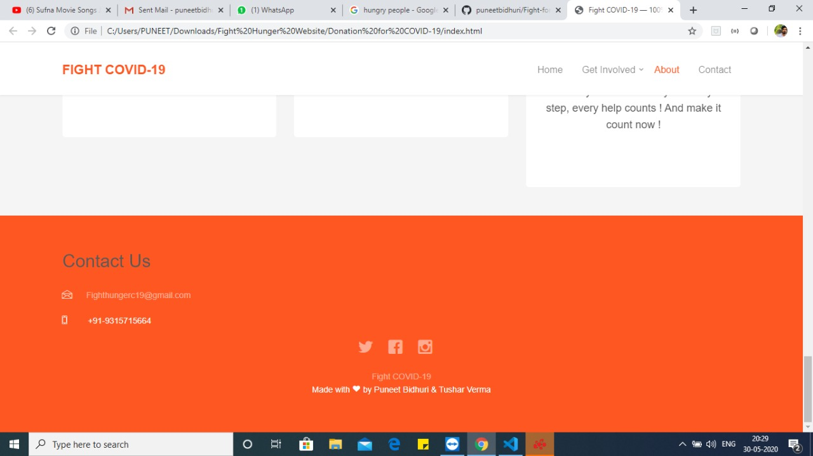

India's nationwide lockdown, has left millions of poor people unable to fulfill their basic needs. We thought that this is a crisis that requires large-scale collaboration, so we designed a website which could help these people. Because of the COVID-19 people don’t want to come outside to help because of the fear of infection. Through our website they can easily donate food, cloths, and other essentials things. In this website, people can easily give their name and the things they wants to distribute. We will collect them and help them to help poor people. E-certificate will also be provided to active participant.  

<h1 screenshots >

